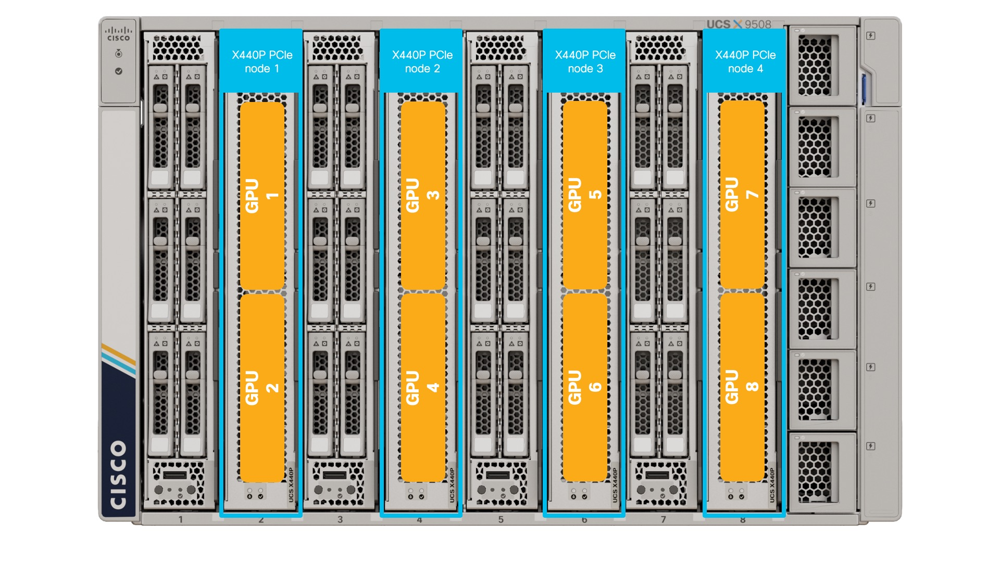
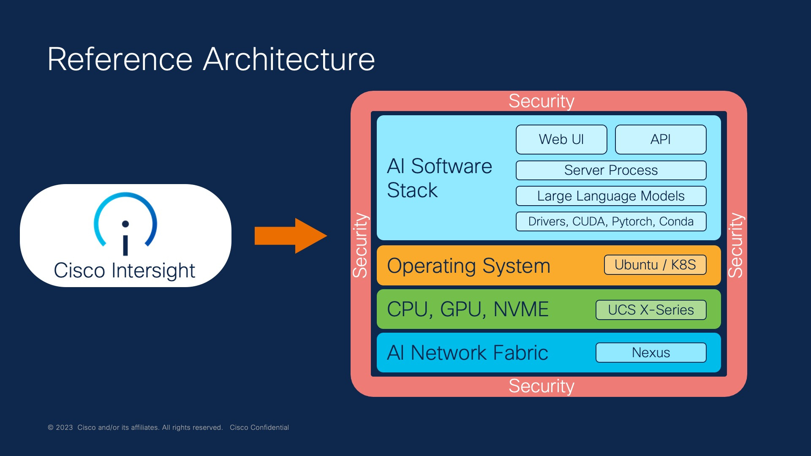

# AI-Toolkit: Automated Installation of Large Language Models on UCS X-Series

Generative AI is an exciting and emerging space. Running large language models (LLMs) in the cloud can be both costly and expose proprietary data in unexpected ways. These issues can be avoided by deploying your AI workload on premise on a modern compute infrastructure. The purpose of this AI toolkit is to automate the full installation of some of the most popular open source software tools on Cisco UCS X-Series. The toolkit makes extensive use of the UCS X-fabric, PCIe node and GPU acceleration.   



This solution guide will assist you with the full installation of:
1. Ubuntu linux operating system including various common utilities
2. GCC compiler required for development using the NVIDIA parallel computing and programming environment (CUDA)
3. NVIDIA GPU drivers as well as CUDA
4. Miniconda package, dependency and environment manager for programming languages (IE: python and C++). Miniconda is a minimal distribution of Anaconda that includes only conda, python, pip and some other useful packages. Very useful for data science as it includes a lot of dependencies in the package.
5. AI Monitor for monitoring CPU, memory, GPU and VRAM utilization on your system
6. WebUI simple user interface for testing and fine-tuning large language models
7. OpenAI compatible API
8. Various LLMs such as Vicuna and Meta Open Pre-Trained Transformer models. Utility to download additional models from Hugging Face is included
9. Software to perform inferencing on locally hosted private documents using LangChain, Chroma on the most popular HuggingFace embedding models and LLMs


## Installing the AI-Toolkit

### Pre-requisites

1. Cisco UCS X-series w/ X440p PCIe node and NVIDIA A100 GPU
2. Cisco Intersight account

### 1. Create Server Profile

In Intersight, derive and deploy a server-profile from a bare-metal linux template to a UCS X-Series X210c compute node. Basically all that is required is:
1. Boot from M.2 RAID
2. Single ethernet NIC with fabric failover (for redundancy)

### 2. Install OS on Server

From Intersight, select server and perform automated OS install. Use the custom OS install script from this repo called llm-bmaas.cfg You will want to modify the cloud-init settings for: password, address, gateway4 and nameservers.

The following combination has been tested:
1. OS Image - ubuntu-22.04.2-live-server-amd64.iso as version Ubuntu Server 22.04 LTS
2. SCU Image - ucs-scu-6.3.1a.iso as version 6.3.1a
3. OS Configuration File - llm-bmaas.cfg as version Ubuntu Server 22.04 LTS

Other combinations may work, but please try these before asking for assistance.


### 3. Install Additional Software

SSH into the server for the first time as username ubuntu and run the following commands (one-time):
```
wget https://github.com/pl247/ai-install/raw/main/ai-install.sh
chmod a+x ai-install.sh
./ai-install.sh
```

Answer yes when asked if you want to proceed during the miniconda install.

YOU WILL NEED TO REBOOT to activate your NVIDIA GPU drivers.

```
sudo reboot
```

## Running the TextGen server software for the first time using CPU

Activate the textgen environment in conda, move to the correct directory and start the text generation server:

```
conda activate textgen
cd text-generation-webui
python server.py --listen --auto-devices --chat --model-menu --cpu
```

To access the application, open a web browser to your server IP address on port 7860.
http://10.0.0.10:7860

### Running the text-generation server software for the first time using A100-80GB GPU

```
conda activate textgen
cd text-generation-webui
python server.py --listen --auto-devices --chat --model-menu --gpu-memory 76
```

If you have an NVIDIA GPU then you can also simultaneously monitor the system using the ai-monitor tool that was installed:
```
/ai/ai-monitor/ai-monitor
```

### Downloading Additional Models for TextGen

Check out the Hugging Face leader board: https://huggingface.co/spaces/HuggingFaceH4/open_llm_leaderboard and then download any of the models you would like to try using the following commands:

```
cd text-generation-webui
python3 download-model.py TheBloke/Wizard-Vicuna-13B-Uncensored-HF
```

Substitute <TheBloke/Wizard-Vicuna-13B-Uncensored-HF> for any Hugging Face model you would like.

Note - the the OPT-350 LLM was included mostly to show how far things have progressed in less than 1 year. 

## Retrieval Augmented Generation (RAG) on Private Documents

To perform inferencing on private localized data on your system, perform the following tasks:
1. Move to the doc-inferencing directory
2. Activate the docs environment in conda
3. Place any documents (type pdf, doc, docx, txt, xls, xlsx, csv, md or py) you would like to query in the SOURCE_DOCUMENTS directory
4. Ingest the documents using ingest.py
5. Run the doc inferencing using run_localGPT.py

```
cd doc-inferencing
conda activate docs
# Ingest docs
python ingest.py
# Run inferencing
python run_localGPT.py
```

To place documents in the SOURCE_DOCUMENTS folder try using wget:

```
wget https://www.cisco.com/c/dam/en/us/products/collateral/servers-unified-computing/ucs-x-series-modular-system/x210cm7-specsheet.pdf

wget https://www.cisco.com/c/dam/en/us/products/collateral/servers-unified-computing/ucs-x-series-modular-system/x9508-specsheet.pdf

wget https://www.cisco.com/c/dam/en/us/products/collateral/servers-unified-computing/ucs-x-series-modular-system/cisco-ucs-6536-fabric-interconnect-spec-sheet.pdf

wget https://www.cisco.com/c/dam/en/us/products/collateral/servers-unified-computing/ucs-x-series-modular-system/x440p-specsheet.pdf
```

### Troubleshooting

If wget doesn't work try the following workaround:

```
sudo vi /usr/lib/ssl/openssl.cnf

#Add the following option to openssl.cnf
[system_default_sect]
Options = UnsafeLegacyRenegotiation
```